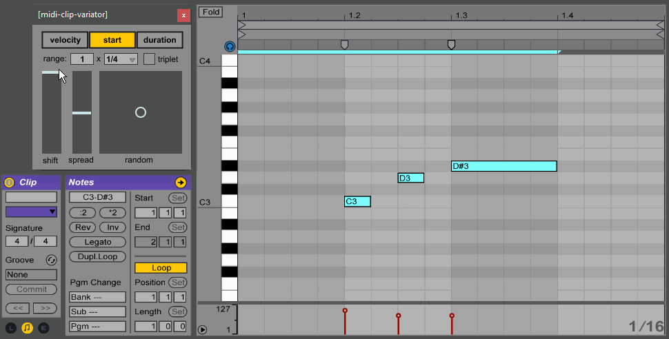

# Ableton MIDI Clip Variator

The **Ableton MIDI Clip Variator**
is a [Max for Live device](http://ableton.com/maxforlive)
for [Ableton Live](http://ableton.com/live/)
that makes it easy to create variations of MIDI clips with tools to modify velocity and timing.

## Installation and Usage

1. [Download](https://github.com/adamjmurray/ableton-midi-clip-variator/archive/master.zip) and unzip in the location of your choice
2. Drag the midi-clip-variator.amxd device into any MIDI track
3. Click the help button for usage instructions

## Features

* Shift the average velocity, start time, and duration of notes.
* Spread the velocity, start time, and duration of notes towards or away from the average value.
* Randomize the velocity, start time, and duration of notes with an intuitive 2-dimensional randomization control.
* Controls are in a floating window that stays on top of Ableton Live, so you can quickly jump between different clips:

## Changelog

* Version 1.1
    * Added range parameter to control the maximum change in value
    * When modifying a clip, automatically show the its detail view if it's not visible
    * Disable the controls and display "Select a MIDI clip" whenever a MIDI clip is not selected
    * Popup the Clip Editor & Help window over the mouse when clicking the associated buttons (instead of a random location)
    * Improved help info
* Version 1.0
    * Edit MIDI clip parameters: velocity, start (note start time), and duration
    * Edit parameters with different operations: shift, spread, random
    * GUI in a always-on-top popup window so you can easily keep using it when moving between different clips

## About

Designed and developed by [Adam Murray](https://github.com/adamjmurray).

Released under a [permissive free software license](https://github.com/adamjmurray/ableton-midi-clip-variator/blob/master/LICENSE.txt)

Built with [Max](http://cycling74.com/products/max/) and JavaScript.

Inspired by the [histogram features in Bitwig Studio](http://bitwig.com/bitwig-studio).

