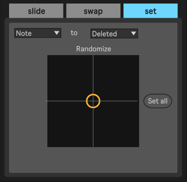

# Ableton MIDI Sculptor

The **Ableton MIDI Clip Sculptor**
is a [Max for Live device](http://ableton.com/maxforlive)
for [Ableton Live](http://ableton.com/live/)
that makes it easy to create variations of MIDI clips with tools to modify pitch, velocity, and timing.

## Installation and Usage

1. [Download Sculptor.amxd v1.0](./releases/1.0/Sculptor.amxd?raw=true)
2. Drag the `Sculptor.amxd` device onto any MIDI track
3. Click the "Sculpting Tools" button to open the main UI in a window
4. Adjust the zoom level as desired
5. Open Live's Info View and hover over any control for documentation

## Features

Some of the things you can do with this device:
* "Humanize" (randomize) the timing and velocity of notes within a controllable range
* "Compress" velocity ranges to tame wild recordings with notes that are too quiet or too loud, or spread the velocities farher apart for more dynamic range.
* Reverse all the pitches without changing timing or velocity
* Randomly swap notes in a drum rack clip for sonic variations with the same timing as the original
* Randomly delete notes to "thin out" a clip to create lower energy variations
* Randomize in all sorts of ways to experiment and overcome writer's block

### Device Panel

* The "Sculpting Tools" button opens the main UI in a **floating window** (always on top of Live), so you can jump between different clips and keep editing.
* The UI is **zoomable** for high resolution monitors.
* Sculpting operations apply to the **selected notes** of the clip, so you can control what's affected.
  * _Note: If nothing is happening, it's probably because you only have one note selected._
* Hovering over any part of the UI shows **documentation** in Live's Info View

There are **3 sculpting tools**.

### Slide Tool

* Operate on the **pitch**, **velocity**, **start time**, or **duration** of the selected notes.
* Set a **maximum range** of the operation.
* **Shift** moves the choosen note property in the positive or negative direction
* **Randomize** moves the choosen note property in a random direction by a random amount (within the choosen range)
  * Every time you use the randomize X-Y pad, a new random value is choosen for each corner. You can "scrub" around looking for sweet spots. Once you let go of the mouse, new random values will be choosen.
* **Spread** spreads the choosen note properties closer together or farther appart.
* **Edge behavior** (the 4 buttons in the lower left) determines what happens when a note hits the minimum or maximum value:
  * **Clip** holds the note property at its minimum/maximum value
  * **Reflect** "bounces" off the edge and moves in the opposite direction
  * **Wrap** wraps around from the minimum to maximum value and vice versa
  * The "**keep going**" option lets notes move off the edge of the clip and removes notes with negative velocities or invalid pitches
* **Spread anchor behavior** (the 3 buttons in the lower right) controls the spread operation:
  * **Lowest**: don't move the note with the lowest value
  * **Middle**: don't move the note with the average value. In other words, spread away from / towards the center.
  * **Highest**: don't move the note with the hihest value

### Swap Tool

* Operate on **a combination of pitch, velocity, and duration**. Start times do not change.
* **Rotate** copies the choosen note properties from one note to the next while keeping the start times the same. The rotation wraps around the end of the clip.
* **Randomly swap** the choosen note properties while keeping the start times the same
  * Every time you use the randomize X-Y pad, new random swap targets are choosen for each corner. You can "scrub" around looking for sweet spots. Once you let go of the mouse, new random targets will be choosen.
* Swap the choosen note properties between **consecutive pairs** of notes.
* **Reverse** the choosen note properties across the notes (e.g. the last note gets the first note's pitch and vice versa)
* **"Zip"** the choosen note properties by splitting the list of notes into two halves and interleaving the halves.

### Set Tool

* Randomly **delete, mute, or unmute notes** for "thinning out" a busy clip
* Set the choosen **pitch**, **velocity**, **start time**, or **duration** on a **random set of notes**
* Set the choosen note property to the choosen value value on **all the selected notes**

## Feature Requests and Bug Reports

Please file a github issue: https://github.com/adamjmurray/ableton-midi-sculptor/issues

## About

Designed and developed by [Adam Murray](https://github.com/adamjmurray).

Released under the [GNU General Public License v3.0](https://github.com/adamjmurray/ableton-midi-sculptor/blob/master/LICENSE.txt).

Built with [Max](http://cycling74.com/products/max/) and JavaScript.

